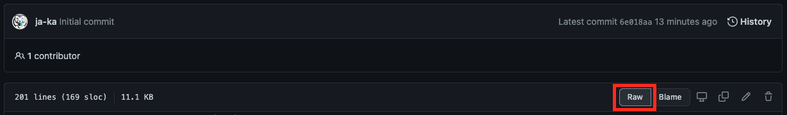
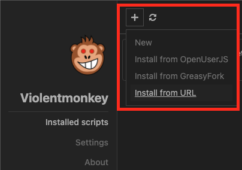
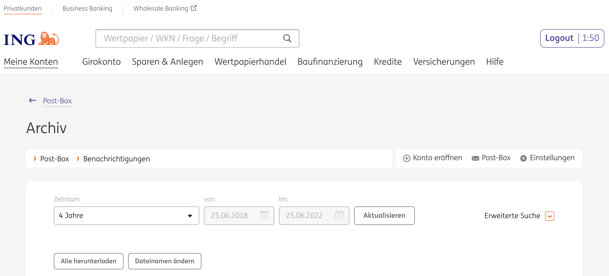

# violentmonkey
A collection of various [Violentmonkey](https://violentmonkey.github.io/) scripts.

## Content

- [Userscript Manager](#userscript-manager)
- [Scripts](#scripts)
  - [Download documents from postbox - ing.de](#download-documents-from-postbox---ingde)

## Userscript Manager

Install Violentmonkey from [github.io](https://violentmonkey.github.io/).

## Scripts

To install a script, navigate to the raw version by clicking on *Raw*. The Violentmonkey plugin in your browser should open automatically. 

In case it does not open, open the plugin yourself and add a new script via the + button.

Select *Install from URL* and paste the link to the raw file or select *New* and copy and paste the script code and hit *Save & Close*.

After successful installation reload the page in question.

### Download documents from postbox - ing.de

#### What it does

The script installs a button *Alle herunterladen* next to *Alle archivieren* and *Gelesene archivieren*. When hitting the button, the script downloads all documents currently visible on the page based on the configured filter. You can adjust the file name of the downloaded files by clicking on *Dateinamen ändern* and providing a file name template including the terms DD, MM, YYYY, ART, BETREFF, for example YYYY-MM-DD_ART_BETREFF.

#### Metadata

**Script:** [ing-postbox-download-all.js](ing-postbox-download-all.js) ([Raw version](https://raw.githubusercontent.com/ja-ka/violentmonkey/master/ing-postbox-download-all.js))

**Website:** https://banking.ing.de/app/postbox
