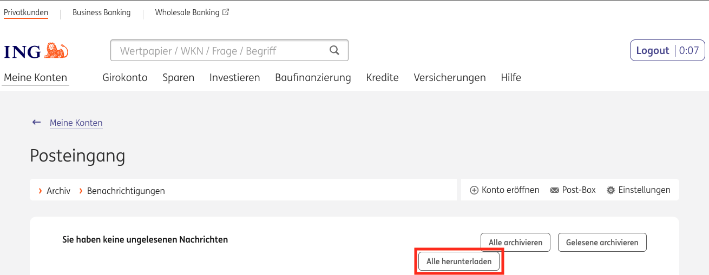

# violentmonkey
A collection of various [Violentmonkey](https://violentmonkey.github.io/) scripts.

## Content

- [Userscript Manager](#userscript-manager)
- [Scripts](#scripts)
  - [Download documents from postbox - ing.de](#download-documents-from-postbox-ing-de)

## Userscript Manager

Install Violentmonkey from [github.io](https://violentmonkey.github.io/).

## Scripts

To install a script, navigate to the raw version by clicking on *Raw*.

After successful installation reload the page in question.

### Download documents from postbox - ing.de

#### What it does

The script installs a button *Alle herunterladen* next to *Alle archivieren* and *Gelesene archivieren*. When hitting the button, the script downloads all documents currently visible on the page based on the configured filter.

#### Metadata

**Script:** [ing-postbox-download-all.js](ing-postbox-download-all.js) ([Raw version](https://raw.githubusercontent.com/ja-ka/violentmonkey/master/ing-postbox-download-all.js))

**Website:** https://banking.ing.de/app/postbox
